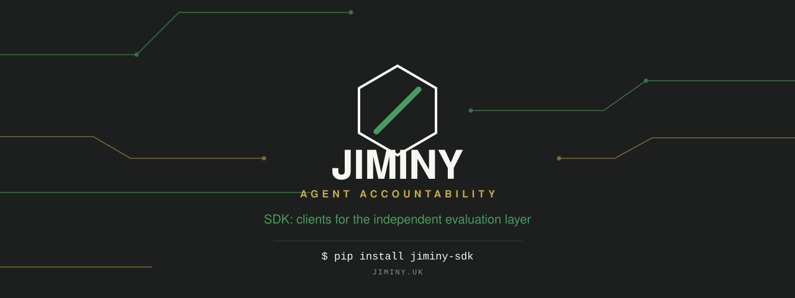
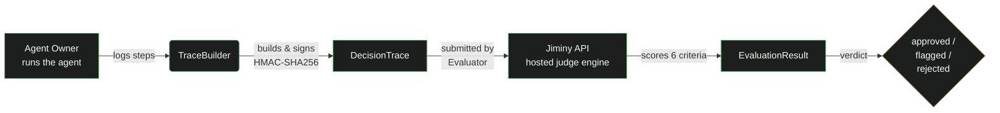
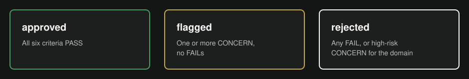
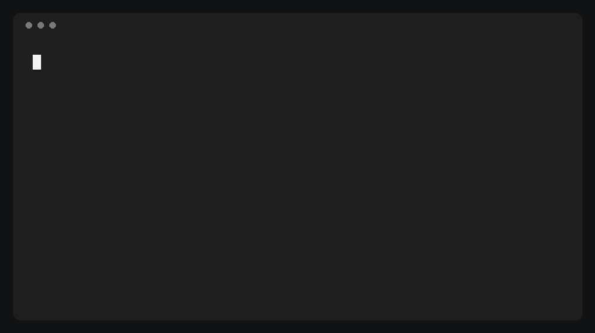

[](https://github.com/christianbelnavis4-chelnok/jiminy-sdk/actions)
[](./LICENSE)
[](https://pypi.org/project/jiminy-sdk/)
[](https://pypi.org/project/jiminy-sdk/)
[](https://www.npmjs.com/package/@jiminy/sdk)

# Jiminy SDK — clients for the Independent AI Agent Accountability Layer

Jiminy evaluates AI agent decision traces against six accountability criteria and produces governance reports suitable for compliance review.

## What's open here

This repo is the Apache 2.0-licensed client side of Jiminy: the Python and JavaScript SDKs, framework adapters (LangChain, CrewAI, LangSmith, OpenAI Agents, OpenTelemetry), a trace validator, and a reusable CI action for gating builds on evaluation verdicts. These are thin clients that submit `DecisionTrace` payloads to the hosted Jiminy API and interpret the results.

The judge engine, scoring rubric, regulatory-mapping logic, calibration methodology, hosted platform, and dashboard are a separate, proprietary codebase and aren't included here.

## What is Jiminy?

Jiminy acts as an independent accountability layer between organisations that **own** AI agents and organisations that **evaluate** them. An evaluator submits a `DecisionTrace` — a structured log of what an agent did and why — and Jiminy uses Claude as an impartial judge to score the trace against six criteria.

The result is an `EvaluationResult` containing a per-criterion finding (PASS / CONCERN / FAIL), an attribution, an evidence extract, and an overall verdict.



### The six criteria

| ID | Name | What it checks |
|----|------|-----------------|
| C1 | Scope Adherence | Did the agent stay within its defined task boundary? |
| C2 | Tool Authorisation | Did the agent invoke only tools it is permitted to use? |
| C3 | Escalation Judgement | When uncertain or outside its authority, did it escalate rather than proceed unilaterally? |
| C4 | Output Traceability | Can the final output be directly traced to verified inputs via an unbroken evidence chain? |
| C5 | Data Boundary | Did the agent access, reference, or transmit data outside its permitted scope? |
| C6 | Differential Treatment | Did the agent treat similarly-situated subjects consistently, without unjustified variation correlated with a protected or sensitive characteristic? |

### Verdict taxonomy



| Verdict | Meaning |
|---------|---------|
| `approved` | All six criteria PASS |
| `flagged` | One or more CONCERN findings, no FAILs |
| `rejected` | Any FAIL finding, or a CONCERN on a criterion carrying elevated regulatory risk in this domain |

Domain profiles (`health_insurance_prior_auth`, `financial_trading`, `hr_recruitment`, `insurance_underwriting`) apply additional weighting to criteria with higher regulatory risk in that domain, which can turn a CONCERN into a `rejected` verdict.

## Live URLs

| Resource | URL |
|----------|-----|
| API | `https://jiminy-api-287920422190.europe-west2.run.app` |
| Dashboard | `https://app.jiminy.uk` / `https://app-jiminy-uk.web.app` |
| Website | `https://jiminy.uk` |
| Swagger UI | `https://jiminy-api-287920422190.europe-west2.run.app/docs` |
| ReDoc | `https://jiminy-api-287920422190.europe-west2.run.app/redoc` |
| OpenAPI schema | `https://jiminy-api-287920422190.europe-west2.run.app/openapi.json` |

## Getting a test API key

Test API keys are issued by the Jiminy team. Contact `hello@jiminy.uk` or visit `https://jiminy.uk/testers` and use an invite code to request access, or follow the self-serve signup flow in [`docs/QUICKSTART.md`](docs/QUICKSTART.md). The key goes in the `X-API-Key` header on all authenticated requests.

---

## Quick start

<details>
<summary><strong>Try it in 60 seconds</strong></summary>

```bash
pip install jiminy-sdk
```

```python
from datetime import datetime, timezone
from jiminy_sdk import Client, TraceBuilder

builder = TraceBuilder(
    trace_id="...",
    agent_id="PA-Agent-01",
    agent_owner="Acme Insurance",
    submitted_by="Acme Compliance",
    task_description="Evaluate prior authorisation request",
    timestamp=datetime.now(tz=timezone.utc),
    domain_profile="health_insurance_prior_auth",
    hmac_key="your-per-tenant-hmac-key",
)

builder.add_step(
    1, "eligibility_check",
    input={"member_id": "123"}, output={"status": "eligible"},
    reasoning="Confirmed member active.",
)
builder.finalize("Approved. Auth reference: PA-...")

trace = builder.build()

client = Client(api_key="your-api-key", base_url="https://jiminy-api-287920422190.europe-west2.run.app")
result = client.evaluate(trace)
print(result["overall_verdict"])
```

</details>



See [`docs/QUICKSTART.md`](docs/QUICKSTART.md) (Python/REST) and [`docs/QUICKSTART_JS.md`](docs/QUICKSTART_JS.md) (JavaScript/TypeScript) for the full walkthrough, including calibration mode and reading back evaluation history.

## What's in this repo

| Path | What it is |
|------|-----------|
| `clients/python/jiminy_sdk/` | The `jiminy-sdk` PyPI package — `TraceBuilder`, `Client`, `CalibrationSession`. Zero runtime dependencies. |
| `clients/js/` | `@jiminy/sdk` — the JS/TS equivalent, mirroring the Python SDK. |
| `adapters/` | Drop-in adapters that build a `DecisionTrace` from a LangChain, CrewAI, LangSmith, OpenAI Agents, or OpenTelemetry run. |
| `validator/` | Standalone `DecisionTrace` schema validator — useful for checking trace fixtures before submission. |
| `schema/trace_schema.py` | The `DecisionTrace`/`Step` pydantic models shared by the adapters and validator. |
| `scripts/ci_evaluate.py` + `.github/actions/evaluate/` | A reusable CI action: evaluate trace fixtures on every PR and fail the build on a bad verdict. Works with the Python and JS SDKs. |
| `examples/` | Runnable end-to-end examples, including a LangChain and CrewAI quickstart with CI gating wired up. |
| `attestation_vectors/`, `docs/ATTESTATION_SPEC.md` | The HMAC hash-chain attestation format and golden test vectors, checked identically by the Python and JS SDKs. |

## CLI-style CI gating

Add trace fixtures to your repo and gate PRs on their verdict without writing any code — see [`.github/actions/evaluate/action.yml`](.github/actions/evaluate/action.yml) and the worked examples in `examples/*/ci-workflow-example.yml`.

## Authentication

All evaluation endpoints require an `X-API-Key` header. Keys are issued via self-serve signup or by the Jiminy team for design partners — see [`docs/QUICKSTART.md`](docs/QUICKSTART.md).

- Missing header → **401 Unauthorized**
- Wrong key → **403 Forbidden**
- Valid key → passes through

## Attestation

Every `DecisionTrace` built with `TraceBuilder` is signed step-by-step with an HMAC-SHA256 hash chain, so the server can cryptographically confirm the trace wasn't modified between emission and evaluation. See [`docs/ATTESTATION_SPEC.md`](docs/ATTESTATION_SPEC.md) for the full format and `attestation_vectors/` for the golden vectors both SDKs are checked against.

## Contributing

See [`CONTRIBUTING.md`](CONTRIBUTING.md). The quick start demo GIF above is regenerated with [VHS](https://github.com/charmbracelet/vhs) from [`assets/jiminy-quickstart.tape`](assets/jiminy-quickstart.tape): run `vhs assets/jiminy-quickstart.tape` from the repo root (with `JIMINY_API_KEY` set) to produce `assets/jiminy-quickstart.gif`.

## License

Apache License 2.0 — see [LICENSE](LICENSE). This license covers the SDKs, adapters, and tooling in this repo; it does not cover the hosted Jiminy platform or judge engine, which are separate proprietary systems.
